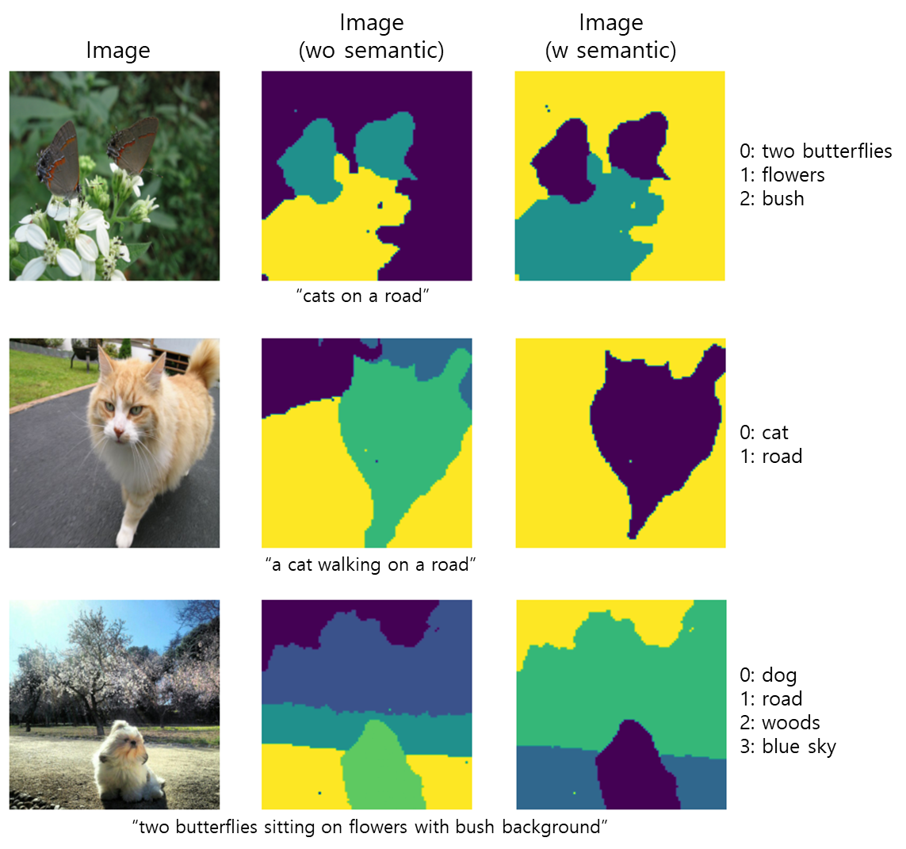

# DiffSeg-pytorch

Unofficial implementation of DiffSeg ("Diffuse attend and segment: Unsupervised zero-shot segmentation using stable diffusion." [1]) using PyTorch. This repo is for practice.

The original repo is [here](https://github.com/google/diffseg).

The images are from OpenImage dataset [4]. The experiment code is in [diffseg_pytorch_exp.ipynb](diffseg_pytorch_exp.ipynb). Note that the darker color represents the lower index of semantic labels.

# References
[1] Tian, J., Aggarwal, L., Colaco, A., Kira, Z., & Gonzalez-Franco, M. (2024). Diffuse attend and segment: Unsupervised zero-shot segmentation using stable diffusion. In Proceedings of the IEEE/CVF Conference on Computer Vision and Pattern Recognition (pp. 3554-3563). 
[2] Hertz, A., Mokady, R., Tenenbaum, J., Aberman, K., Pritch, Y., & Cohen-Or, D. (2022). Prompt-to-prompt image editing with cross attention control. arXiv preprint arXiv:2208.01626. 
[3] Chefer, H., Alaluf, Y., Vinker, Y., Wolf, L., & Cohen-Or, D. (2023). Attend-and-excite: Attention-based semantic guidance for text-to-image diffusion models. ACM transactions on Graphics (TOG), 42(4), 1-10. 
[4] A. Kuznetsova, H. Rom, N. Alldrin, J. Uijlings, I. Krasin, J. Pont-Tuset, S. Kamali, S. Popov, M. Malloci, A. Kolesnikov, T. Duerig, and V. Ferrari. The Open Images Dataset V4: Unified image classification, object detection, and visual relationship detection at scale. IJCV, 2020.

